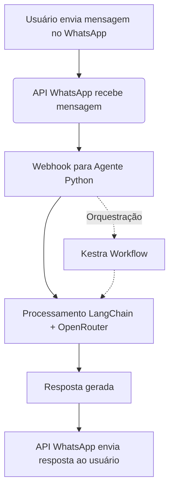

# Desenvolvimento do Agente WhatsApp com LangChain e Kestra

## Checklist de Bibliotecas e Ferramentas

- [ ] Python >= 3.10
- [ ] LangChain (`pip install langchain`)
- [ ] API do WhatsApp (Ex: `wppconnect`, `whatsapp-web.js`, ou similar via HTTP/WebSocket)
- [ ] Kestra (https://github.com/kestra-io/kestra) — orquestrador, rodando via Docker ou standalone
- [ ] openrouter Python SDK ou `requests` para chamada da API OpenRouter
- [ ] FastAPI ou Flask (para expor endpoints HTTP do agente)
- [ ] Docker (opcional, mas recomendado)
- [ ] Docker Compose (para orquestrar múltiplos serviços)
- [ ] Ferramentas auxiliares: `python-dotenv`, `logging`, `pytest`, `requests`, `pydantic`

## Lógica de Integração

### 1. Recepção de Mensagens (WhatsApp)
- O agente recebe mensagens via integração com uma API de WhatsApp (ex: wppconnect-server).
- As mensagens são encaminhadas para o endpoint HTTP do agente Python.

### 2. Orquestração (Kestra)
- Kestra pode ser usado para orquestrar fluxos de trabalho, como:
  - Receber mensagem do WhatsApp
  - Chamar o agente Python (via HTTP ou fila)
  - Processar resposta e devolver ao WhatsApp
- Workflows definidos em YAML ou via interface do Kestra.

### 3. Processamento com LangChain
- O agente Python utiliza LangChain para:
  - Orquestrar prompts
  - Gerenciar contexto e memória de conversação
  - Integrar com ferramentas externas, se necessário

### 4. Seleção de Modelo (OpenRouter)
- O agente consulta a API do OpenRouter para selecionar e utilizar o modelo LLM desejado.
- A chave de API e o modelo são configuráveis via `.env`.

### 5. Resposta ao Usuário
- O agente devolve a resposta processada ao WhatsApp via API.

---

## Diagrama do Fluxo de Integração



## Fluxo Resumido

1. Usuário envia mensagem no WhatsApp
2. API do WhatsApp encaminha mensagem ao agente Python
3. Agente processa a mensagem com LangChain e consulta a OpenRouter
4. Resposta é enviada de volta ao WhatsApp
5. Kestra pode orquestrar, monitorar e escalar o fluxo

---

## Como Criar um Trigger Comercial (Passo a Passo)

### 1. Configure o Webhook do WhatsApp
- No painel da API WhatsApp (ex: WPPConnect), configure o endpoint de webhook para apontar para `http://<SEU_AGENT>:8000/webhook`.

### 2. Crie um Workflow no Kestra
- No painel do Kestra, crie um novo workflow YAML.
- Exemplo de trigger HTTP:

```yaml
id: whatsapp-trigger
namespace: comercial
triggers:
  - id: http-receive
    type: io.kestra.core.models.triggers.types.HttpTrigger
    uri: /api/whatsapp/comercial
    method: POST
    conditions: []
tasks:
  - id: processa-mensagem
    type: io.kestra.plugin.scripts.python.Script
    script: |
      import requests
      mensagem = inputs['mensagem']
      numero = inputs['numero']
      requests.post('http://agent:8000/webhook', json={
        'from_number': numero,
        'message': mensagem
      })
```

### 3. Integre sua Aplicação Comercial
- Sua aplicação pode disparar chamadas HTTP para o endpoint configurado no trigger do Kestra (`/api/whatsapp/comercial`).
- Exemplo de chamada (em Python):

```python
import requests
requests.post('http://<kestra>:8080/api/whatsapp/comercial', json={
    'mensagem': 'Olá, preciso de atendimento',
    'numero': '+5511999999999'
})
```

### 4. Fluxo Completo
- A aplicação comercial envia a requisição para o Kestra.
- O Kestra executa o workflow, que envia a mensagem ao agente Python.
- O agente responde via WhatsApp ao usuário final.

---

## Observações sobre Docker
- **Uso Local:** Docker é recomendado para facilitar o setup e isolar dependências, mas não é obrigatório. Sem Docker, será necessário instalar manualmente todas as dependências e configurar o ambiente.
- **Produção (VPS):** Docker simplifica o deploy, atualização e escalabilidade.

---

## Pontos de Atenção
- Certifique-se de que todas as integrações (WhatsApp, Kestra, OpenRouter) estejam funcionando localmente antes de migrar para produção.
- Utilize variáveis de ambiente para credenciais e configurações sensíveis.
- Implemente testes automatizados para garantir a robustez do agente.

---

## Referências
- [Kestra GitHub](https://github.com/kestra-io/kestra)
- [LangChain](https://python.langchain.com/)
- [OpenRouter](https://openrouter.ai/)
- [WPPConnect](https://github.com/wppconnect-team/wppconnect-server)

---

> Checklist e lógica inicial prontos para iniciar o desenvolvimento do agente substituto do N8N.
